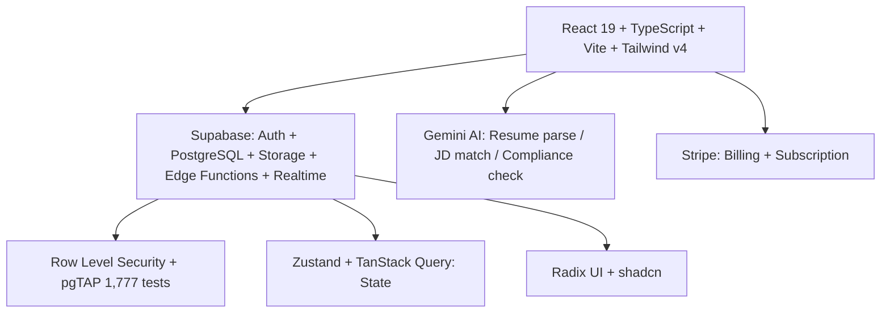

# AdminMate AI — HR Platform for SEA SMEs

<p align="center">
  
  
  
  
  
  
  
</p>

> **Recruitment → Hiring → Onboarding → Payroll → Compliance** for Thailand, Vietnam, Indonesia — AI-powered, compliance-aware, production hardened.

<p align="center">
  
  
  
</p>

---

### Demo

> **Add `docs/demo.gif` — 30s of recruitment flow (job post → candidate → offer → payroll)**

<p align="center">
  
  <br/>
  <em>React 19 + Supabase + Gemini AI — from job posting to payslip</em>
</p>

---

### Why AdminMate AI

SEA SMEs juggle spreadsheets, LINE chats, and local labor law PDFs. AdminMate AI centralizes HR into one compliance-aware platform with AI assistance — not just CRUD, but **workflow + law + AI**.

**1,777/1,777 pgTAP tests PASS · Gates A–L closed · Prod hardened (2026-06-23)**

---

### Architecture



**Stack:** React 19 · TypeScript 5.8 · Vite 6 · Tailwind v4 · Zustand + TanStack Query · React Router v7 (lazy) · Radix UI · Supabase (PostgreSQL, Auth, Storage, Edge Functions) · Gemini AI · Stripe

---

### Quickstart (3 commands)

```bash
git clone https://github.com/bravforcode/adminmate-ai.git
cd adminmate-ai
cp .env.example .env  # set SUPABASE_URL, SUPABASE_ANON_KEY, GEMINI_API_KEY, STRIPE_KEY
```

```bash
bun install
bun run dev        # http://localhost:5173
# or with Supabase local:
supabase start
```

**Production:**
```bash
bun run build
bun run preview
```

---

### Features

| Module | What it does |
|---|---|
| **Recruitment** | Job posts → Applicants → AI resume parsing + JD match scoring |
| **Hiring** | Offer letters → E-sign → Onboarding checklist |
| **Onboarding** | Tasks, docs, equipment, compliance training |
| **Payroll** | Salary, OT, deductions, payslips — TH/VN/ID tax aware |
| **Compliance** | Labor law checks, contract templates, audit trail |
| **Workforce** | Org chart, attendance, leave, performance |

---

### Results & Quality Gates

| Metric | Value |
|---|---|
| **pgTAP database tests** | **1,777 / 1,777 PASS** |
| **Gates** | **A–L closed** |
| **Frontend** | React 19 + TS 5.8 + Vite 6 + Tailwind v4 · lazy routes · RLS |
| **Security** | Supabase RLS · Auth · Storage policies · Audit log |

```bash
# Verify
bun run lint
bun run test
bun run build
# DB
supabase test db  # runs 1,777 pgTAP
```

---

### Tech Stack (Badges)

| Layer | Tech |
|---|---|
| **Frontend** | React 19 · TypeScript 5.8 · Vite 6 · Tailwind v4 · Radix UI |
| **State** | Zustand (auth/UI) + TanStack Query (server) · React Router v7 |
| **Backend** | Supabase (PostgreSQL + Auth + Storage + Edge Functions + Realtime) |
| **AI** | Gemini AI (resume/JD/compliance) |
| **Payments** | Stripe |

---

### Roadmap

- [x] Recruitment → Payroll core + 1,777 pgTAP
- [ ] Multi-country payroll edge cases (VN/ID specifics)
- [ ] Gemini cost optimization + offline fallback
- [ ] Mobile PWA for field attendance

---

### Contact

**Phirawit Jitnarong — Founder @AdminMate AI**
`nxme176@gmail.com` · `092-551-0427` · [LinkedIn](https://www.linkedin.com/in/%E0%B8%9E%E0%B8%B5%E0%B8%A3%E0%B8%A7%E0%B8%B4%E0%B8%8A%E0%B8%8D%E0%B9%8C-%E0%B8%88%E0%B8%B4%E0%B8%95%E0%B8%93%E0%B8%A3%E0%B8%87%E0%B8%84%E0%B9%8C-0000393a4) · [Fastwork](https://fastwork.co/user/bravforcode?source=search)

> Hiring for HR Tech / Compliance AI? Let's talk — production hardened, compliance-aware.
